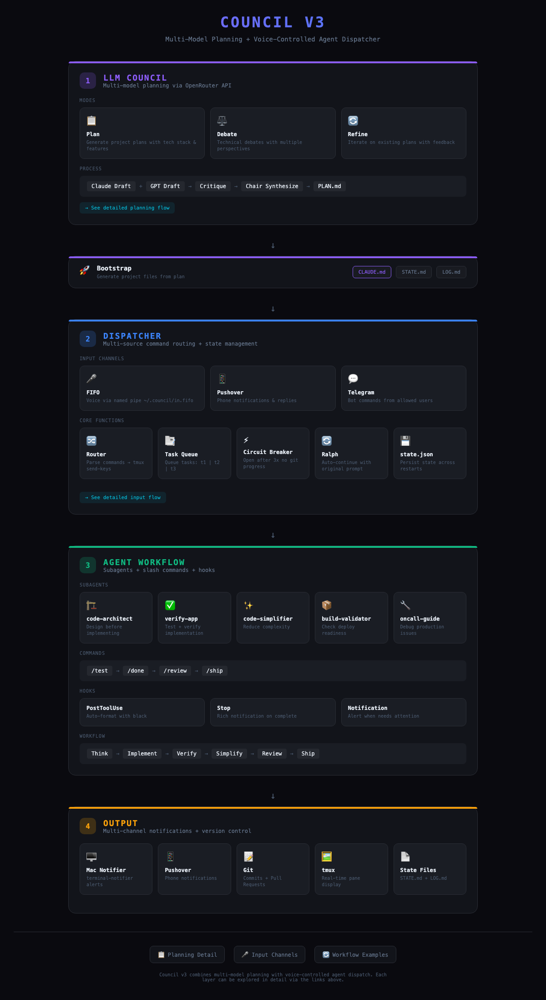
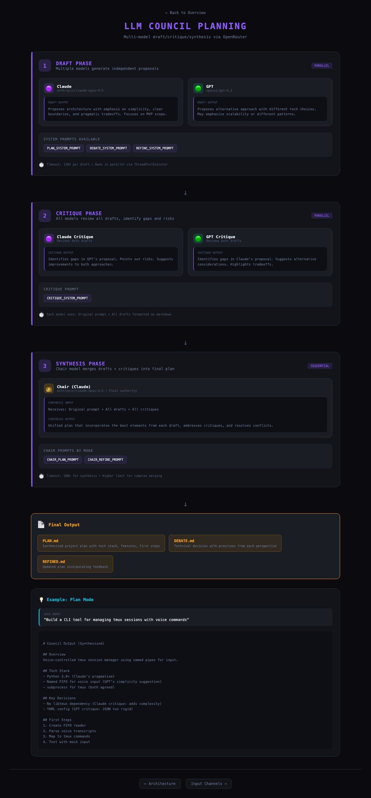
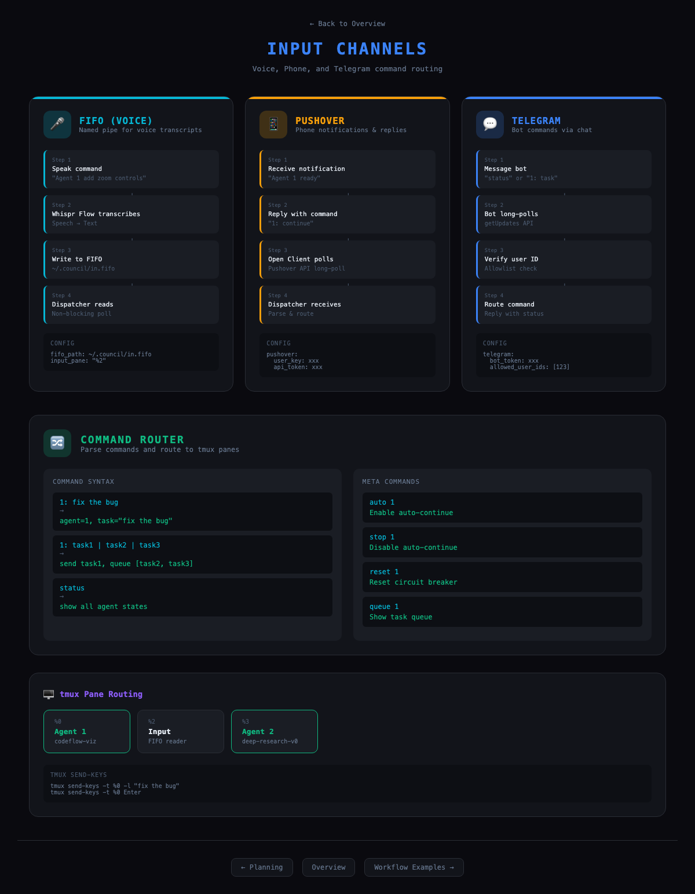
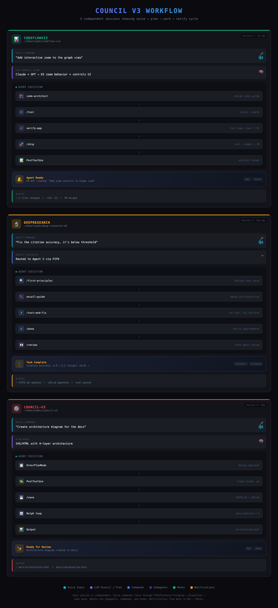

# Council v3

Voice/phone command router for multiple Claude Code agents in tmux panes.

## What it does

- Routes commands from FIFO (voice), Pushover (phone), Telegram to tmux panes
- Auto-continue with circuit breaker (git-based progress detection)
- Task queue for sequential execution
- Notifications (Mac + Pushover)

## Architecture

Council-v3 operates in 4 layers:

```
LLM Council  →  Dispatcher  →  Agent Workflow  →  Output
(planning)      (routing)      (execution)        (notifications)
```

### System Overview
[](docs/architecture.html)

### LLM Council Planning
Multi-model draft/critique/synthesis flow:
[](docs/planning.html)

### Input Channels
FIFO, Pushover, Telegram routing:
[](docs/inputs.html)

### Coordination Examples
Real workflow sessions:
[](docs/coordination.html)

## Quick Start

```bash
# Install
pip install -e .

# Configure
cp config.example.yaml ~/.council/config.yaml
# Edit with your tmux pane IDs and API keys

# Run dispatcher
python -m council.dispatcher.simple
```

## Dispatcher Commands

| Command | What |
|---------|------|
| `1: <text>` | Send text to agent 1 |
| `1: t1 \| t2` | Send t1 now, queue t2 for later |
| `queue 1` | Show queue for agent 1 |
| `clear 1` | Clear queue for agent 1 |
| `auto 1` | Enable auto-continue for agent 1 |
| `stop 1` | Disable auto-continue |
| `reset 1` | Reset circuit breaker |
| `status` | Show all agents |
| `quit` | Exit |

## Key Features

### Task Queue
Send multiple tasks with pipe syntax:
```
1: implement feature | write tests | update docs
```
First task runs immediately, rest queue and execute when agent becomes ready.

### Circuit Breaker
Detects stuck agents via git progress. Opens after 3 iterations without commits.

### Input Sources
- **FIFO** - Voice commands via macOS dictation
- **Pushover** - Phone notifications with reply
- **Telegram** - Bot commands from anywhere

## Agent Workflow

Built-in subagents:
- `code-architect` - Design before implementing
- `verify-app` - Test implementation works
- `code-simplifier` - Reduce complexity
- `build-validator` - Check deployment readiness
- `oncall-guide` - Debug production issues

Slash commands: `/test`, `/done`, `/review`, `/ship`, `/commit`, `/save`

## Config Example

```yaml
agents:
  1:
    pane_id: "%0"
    name: "CodeflowViz"
    worktree: ~/projects/codeflow-viz
  2:
    pane_id: "%1"
    name: "DeepResearch"
    worktree: ~/projects/deep-research-v0

fifo_path: ~/.council/in.fifo
poll_interval: 2.0

pushover:
  user_key: "xxx"
  api_token: "xxx"

telegram:
  bot_token: "xxx"
  allowed_user_ids: [123456789]
```

## Testing

```bash
pytest tests/ -v
```

84 tests covering state detection, command parsing, circuit breaker, tmux routing, and task queue.

## License

MIT
