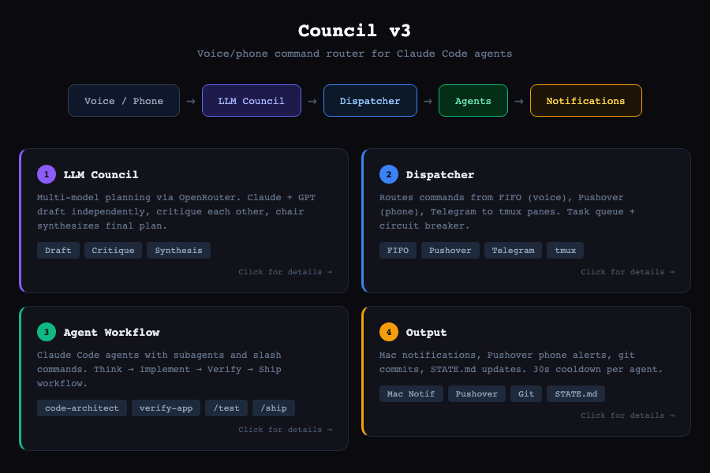

# Council v3

Voice/phone command router for multiple Claude Code agents in tmux panes.

## Architecture

[](docs/overview.html)

**Detailed docs:** [Planning](docs/planning.html) | [Inputs](docs/inputs.html) | [Coordination](docs/coordination.html) | [Full Architecture](docs/architecture.html)

## Quick Start

```bash
# Install
pip install -e .

# Configure
cp config.example.yaml ~/.council/config.yaml

# Run dispatcher
python -m council.dispatcher.simple
```

## Commands

| Command | What |
|---------|------|
| `1: <text>` | Send to agent 1 |
| `1: t1 \| t2` | Queue multiple tasks |
| `status` | Show all agents |
| `auto 1` / `stop 1` | Toggle auto-continue |
| `reset 1` | Reset circuit breaker |

## Config

```yaml
agents:
  1:
    pane_id: "%0"
    name: "Agent1"
    worktree: ~/projects/project1

fifo_path: ~/.council/in.fifo
pushover:
  user_key: "xxx"
  api_token: "xxx"
```

## Testing

```bash
pytest tests/ -v  # 84 tests
```
